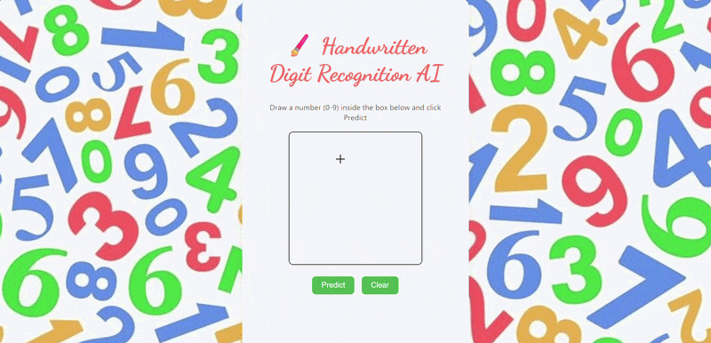

# 🖌️ Handwritten Digit Recognition AI

This project is a Machine Learning web application that recognizes handwritten digits (0–9) using a trained neural network.

Users can draw a digit on a canvas, and the AI model predicts the number instantly.

## 📷 Demo



## Features

• Draw digits directly on the browser  
• AI predicts the digit instantly  
• Shows prediction confidence  
• Built with Flask + TensorFlow  
• Clean interactive UI

## Technologies Used

Python  
TensorFlow / Keras  
Flask  
NumPy  
HTML  
CSS  
JavaScript

## Project Structure
```
digit-recognition-ml
│
├── static
│   └── style.css
│
├── templates
│   └── index.html
│
├── digit_model.h5
├── model.py
├── predict.py
├── app.py
├── requirements.txt
├── README.md
└── .gitignore
```
## How to Run

1. Clone the repository

2. Install dependencies

pip install -r requirements.txt

3. Run the application

python app.py

4. Open in browser

http://127.0.0.1:5000

## Model

The model is trained on the **MNIST dataset** using a simple neural network.

It achieves around **98% accuracy** on the test dataset.
